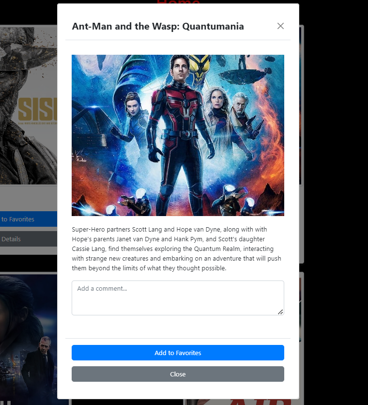
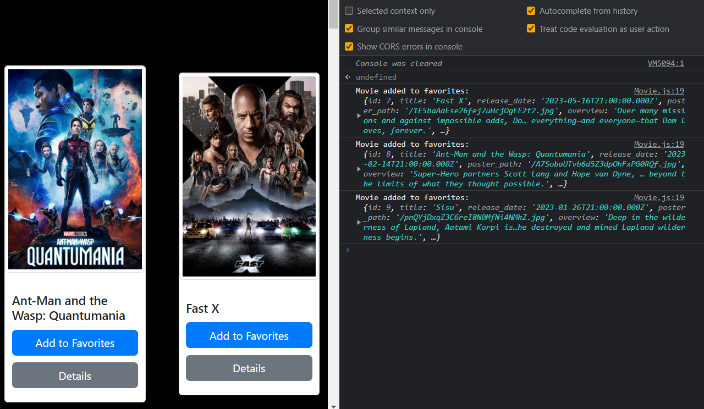
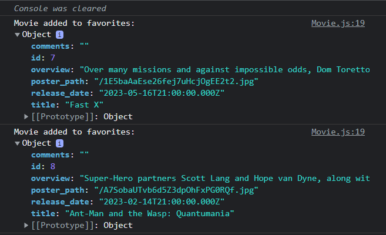

# Netflix Clone 
## v1.1

This is a Netflix clone web application built with React. It allows you to browse movies and add them to your favorites.

## Getting Started

1. Clone the repository: `git clone https://github.com/saleh2001k/netflix-clone`
2. Install dependencies: `npm install`
3. Start the development server: `npm start`
4. Add the following environment variables to the `.env` file:
   - REACT_APP_API_KEY: Your API key for The Movie Database (TMDb) API.
   - REACT_APP_API_BASE_URL: Base URL for TMDb API (e.g., `https://api.themoviedb.org/3`).
   - PORT = your port

## Features

- Browse and search movies
- View movie details in a modal
- Add movies to favorites
- Add comments to movies
- Responsive design

## Code Changes

### Movie.js

- Added functionality to add movies to favorites.
- Implemented the modal component to display movie details.
- Updated the card design to have equal width and height.

### ModalMovie.js

- Added a textarea to input comments.
- Handled the addition of movies to favorites.
- Improved the modal layout and styling.

### server.js

- Implemented an API endpoint at `/addMovie` to handle the addition of movies to favorites.
- Utilized the Express framework to handle the API requests.
- Stored the movie data in a database or data store.
- Like in the image below:

- The server repo link : https://github.com/saleh2001k/movies-library
## Technologies Used

- React
- Axios
- React Bootstrap

